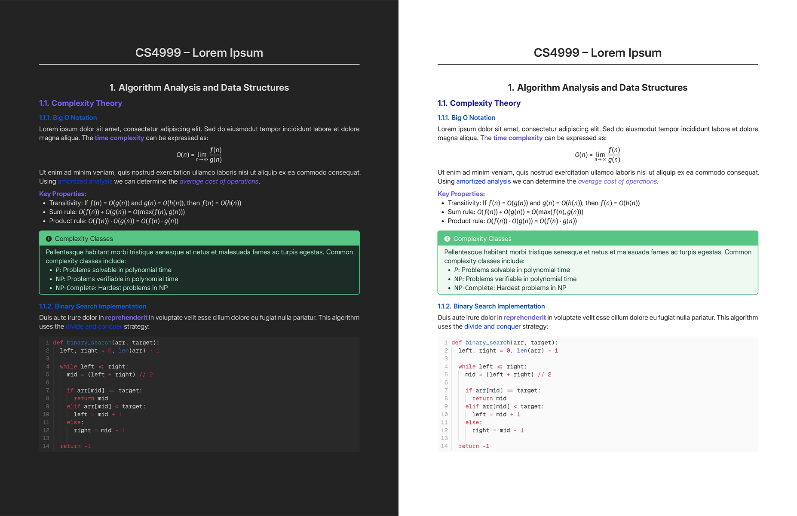

# Typsidian

Obsidian-inspired Typst template for note taking, outlines, and knowledge management.



_Left: `theme: "dark"`, Right: `theme: "light"`_

## Options

- `title` - Document title
- `author` - Document author
- `course` - Course name or subtitle
- `text-args` - Text arguments for main and mono text styles
  - `main` - Main text style
    - `font` - Font family (default: "Inter 24pt")
    - `weight` - Font weight (default: "regular")
    - `size` - Font size (default: 10pt)
  - `mono` - Monospaced text style
    - `font` - Font family (default: "GeistMono NFP")
    - `weight` - Font weight (default: "regular")
    - `size` - Font size (default: 1.1em)
- `show-index` - Whether to show the [index](https://typst.app/universe/package/glossarium/) (default: false)
- `index-entry-list` - List of index entries (default: empty array)
- `theme` - Theme, either "light" or "dark" (default: "light")
- `show-heading-colors` - Whether to show heading colors (default: true)
- `show-bold-color` - Whether to show bold text color (default: true)
- `show-italic-color` - Whether to show italic text color (default: true)
- `standalone` - True for standalone documents, false for use with my [Typst for Obsidian plugin](https://github.com/k0src/Typst-for-Obsidian)

## Usage

### As Standalone Template

1. Copy `template.typ` to your project directory.
2. Create a new Typst file and import the template with desired options:

```typst
#import "template.typ": *
#show: typsidian.with(theme: "dark", title: "My Document", course: "CS4999", show-index: true, index-entry-list: (
    (key: "example", short: "An example index entry"),
))
```

3. Use `#make-title(show-outline: true)` to generate the title page.
4. Write your document content below the title.

### With Typst for Obsidian Plugin

1. Install the [Typst for Obsidian plugin](https://github.com/k0src/Typst-for-Obsidian)
2. Copy `template.typ` to your Obsidian vault.
3. Create a new Typst file in Obsidian and import the template with desired options:

```typst
#import "template.typ": *
#show: typsidian.with(theme: "dark", title: "My Document", course: "CS4999", standalone: false)
```

4. Use `#make-title(show-outline: true)` to generate the title page.
5. Write your document content below the title.

> [!NOTE]
> When using with the Typst for Obsidian plugin, set `standalone: false`, and remove the default layout function for best results.

## Dependencies

- [zebraw](https://typst.app/universe/package/zebraw)
- [itemize](https://typst.app/universe/package/itemize)
- [showybox](https://typst.app/universe/package/showybox)
- [glossarium](https://typst.app/universe/package/glossarium/)
- [fontawesome](https://typst.app/universe/package/fontawesome)
